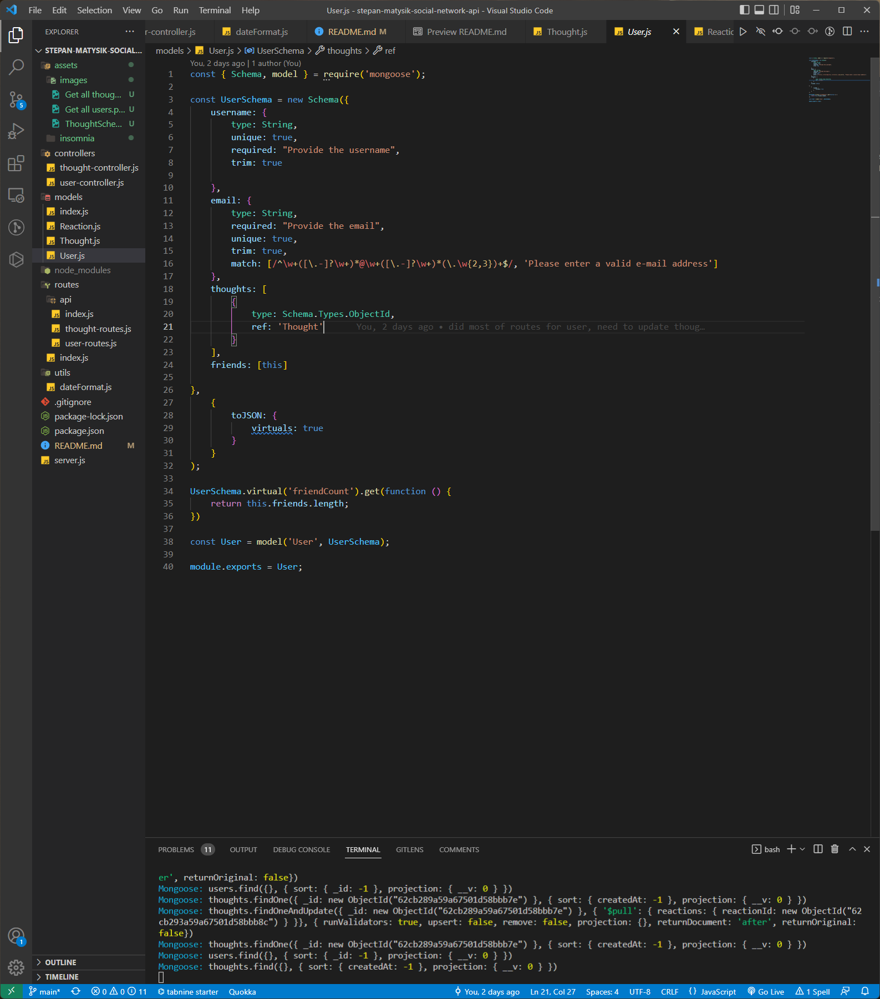
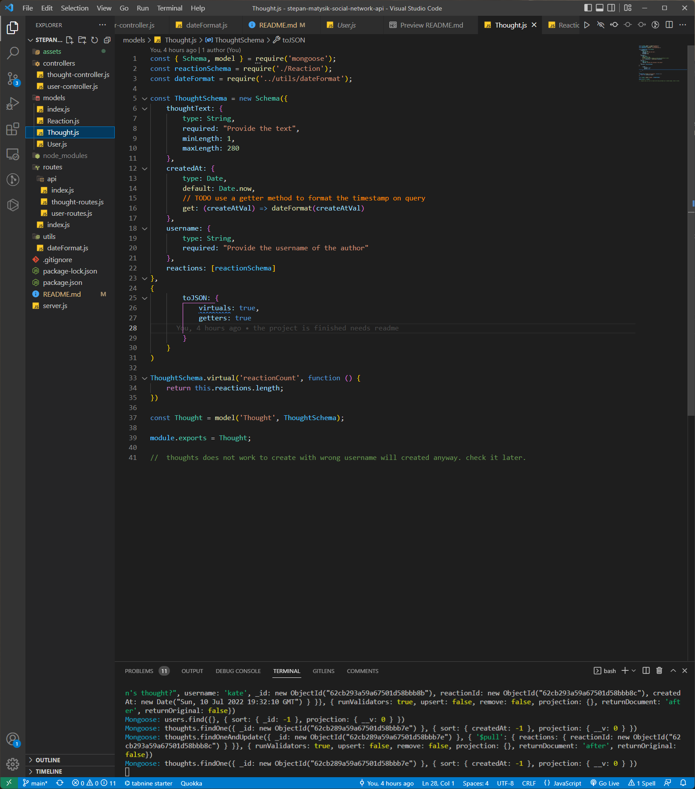

# Stepan Matysik's Social Network API
> Social Network API project.
> A link to the walkthrough video is [_here_](https://youtu.be/R3Qp5U0_jTw).

## Table of contents
* [General info](#general-info)
* [Technologies](#technologies)
* [Installation](#installation)
* [Instructions](#instructions)
* [Features](#features)
* [Screenshots](#screenshots)
* [Usage](#usage)
* [Project Status](#project-status)
* [Room for Improvement](#room-for-improvement)
* [Acknowledgements](#acknowledgements)
* [Contacts](#contact)


## General Info
The back end project there you can create users with thoughts add friends to users and reactions to thoughts.
## Technologies
Project is created with:
- JavaScript
- Node.js
- npm
- MongoDB

## Installation
To open this project in vscode using git in Terminal/Git Bash:

```
cd in directory there you want to store your project
git clone https://github.com/elfsvet/stepan-matysik-social-network-api.git
code .
```

## Instructions
1. In terminal inside the directory:
```
npm install
npm start
```
2. Open Insomnia and open this file Insomnia: [_social-network-api_](./assets/insomnia/Insomnia_social-network-api.json). 
- You would need to open Insomnia and click on Create button;
- Choose Import from File
- Select the file from: your_directory_of_the_project->./assets/insomnia/Insomnia_social-network-api.json
- Open social-network-api Document in Insomnia and test the server is running after npm start in terminal.
- Test all routes.
## Features
- Express package
- Session package
- Mongoose package
- Router method of express package

## Screenshots

> In case you missed the walkthrough video at the top click [_here_](https://youtu.be/R3Qp5U0_jTw).






## Usage
To create a social network app
## Project Status
Project is: _complete_

## Room for Improvement
To do:
- create the front end for the social network app

## Acknowledgements
- This project was inspired by UM Coding Boot Camp
- This project was created from scratch with provided gif reference.


## Contact
> If you still have any questions, please don't hesitate to contact me:
Created by [@elfsvet](https://github.com/elfsvet)
- [LinkedIn](https://www.linkedin.com/in/stepanmatysik/)
